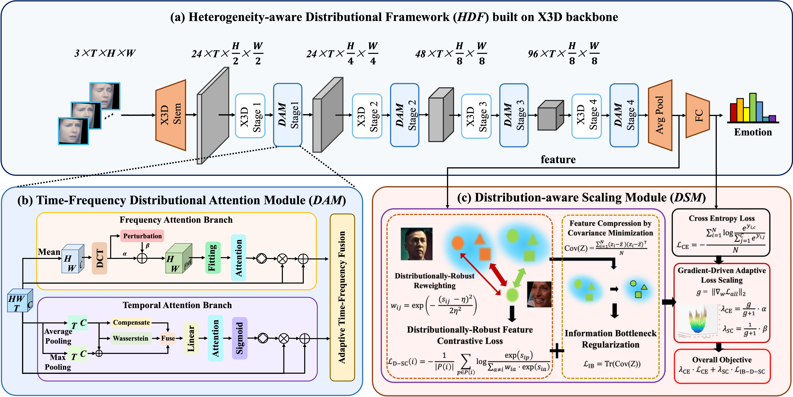

# [ACM MM'25]Learning from Heterogeneity: Generalizing Dynamic Facial Expression Recognition via Distributionally Robust Optimization 

The core code of the conference version has been made open source. The extended version of this paper is currently in the submission stage. Once the paper is officially published, all the codes will be freely accessible.

(July, 2025) Our paper "Learning from Heterogeneity: Generalizing Dynamic Facial Expression Recognition via Distributionally Robust Optimization" has been accepted by ACM MM 2025. 

## Abstract
Dynamic Facial Expression Recognition (DFER) plays a critical role in affective computing and human-computer interaction. Although existing methods achieve comparable performance, they inevitably suffer from performance degradation under sample heterogeneity caused by multi-source data and individual expression variability. To address these challenges, we propose a novel framework, called Heterogeneity-aware Distributional Framework (HDF), and design two plug-and-play modules to enhance time-frequency modeling and mitigate optimization imbalance caused by hard samples. Specifically, the Time-Frequency Distributional Attention Module (DAM) captures both temporal consistency and frequency robustness through a dual-branch attention design, improving tolerance to sequence inconsistency and visual style shifts. Then, based on gradient sensitivity and information bottleneck principles, an adaptive optimization module Distribution-aware Scaling Module (DSM) is introduced to dynamically balance classification and contrastive losses, enabling more stable and discriminative representation learning. Extensive experiments on two widely used datasets, DFEW and FERV39k, demonstrate that HDF significantly improves both recognition accuracy and robustness. Our method achieves superior weighted average recall (WAR) and unweighted average recall (UAR) while maintaining strong generalization across diverse and imbalanced scenarios. 

## Acknowledgments
The project is designed on [DFEW](https://github.com/jiangxingxun/DFEW), [FERV39k](https://github.com/wangyanckxx/FERV39k),  [SAM](https://github.com/davda54/sam),  [X3D](https://arxiv.org/abs/2004.04730), and [M3DFEL](https://github.com/Tencent/TFace/blob/master/attribute/M3DFEL/README.md), thanks to these works!
